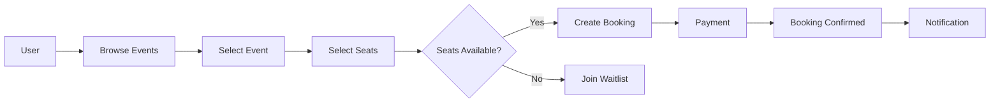
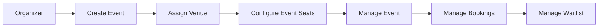
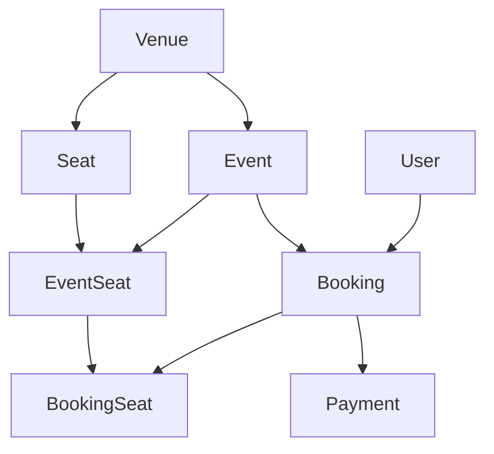
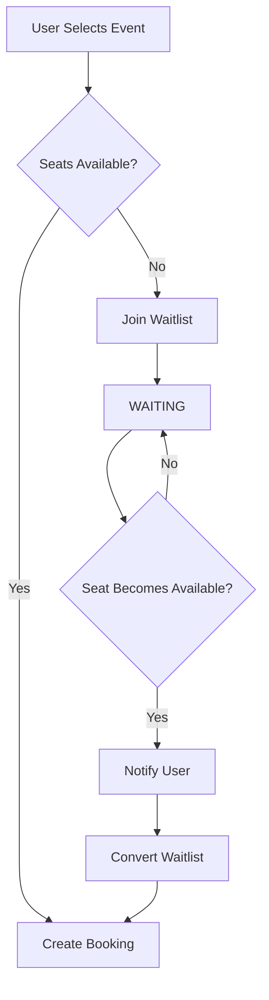
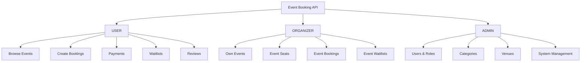
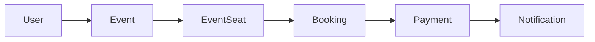
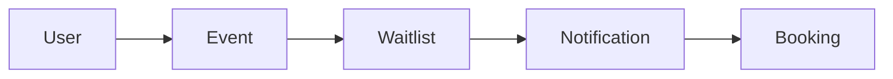

# Event Booking API — Project Overview

## 1. Project Purpose

**Event Booking API** is a RESTful backend application for managing events and the complete booking process.

The system supports three main roles:

- **USER** — browses events, books seats, makes payments, joins waitlists and submits reviews.
- **ORGANIZER** — creates and manages owned events, event seats, bookings and waitlists.
- **ADMIN** — manages users, roles, categories, venues and system-level resources.

---

## 2. Main Modules

| Module | Purpose |
|---|---|
| **Auth** | Registration and authentication |
| **User** | User profiles and roles |
| **Category** | Event categories |
| **Venue** | Event locations |
| **Seat** | Physical seats inside venues |
| **Event** | Event management |
| **EventSeat** | Seat configuration for a specific event |
| **Booking** | Event reservations |
| **BookingSeat** | Seats assigned to a booking |
| **Payment** | Booking payments |
| **Waitlist** | Waiting list management |
| **Review** | Event reviews |
| **Notification** | User notifications |

---

# 3. Complete Event Booking Flow

The main user journey starts with event discovery and continues through seat selection, booking and payment.

If the selected seats are available, the user continues with the booking process.

If no seats are available, the user can join the waitlist.

---

# 4. Organizer Flow

An organizer manages the complete lifecycle of owned events.

Ownership rules ensure that an organizer manages only the resources related to their own events.

---

# 5. Seat and Booking Structure

The system separates physical seats from seats configured for a specific event.

### Main Relationships

- A **Venue** contains physical `Seat` records.
- An **Event** takes place in a venue.
- An **EventSeat** connects a physical seat with a specific event.
- A **BookingSeat** connects an event seat with a booking.
- A **Booking** belongs to a user and an event.
- A **Payment** is associated with a booking.

This structure allows the same physical seat to be reused across different events.

---

# 6. Waitlist Flow

When booking is not immediately possible, the user can join the event waitlist.

The waitlist provides an alternative path to booking when availability changes later.

---

# 7. Roles and Responsibilities

The system separates responsibilities between `USER`, `ORGANIZER` and `ADMIN`.

---

# 8. Project Summary

The main business flow of the application is:

When immediate booking is not possible:

**Event Booking API** combines event management, venue and seat configuration, reservations, payments, waitlists, reviews and notifications in a single backend system.

---

**Next:** `02-ARCHITECTURE.md`