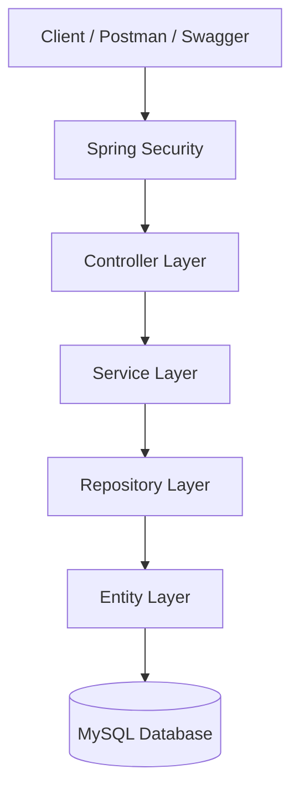
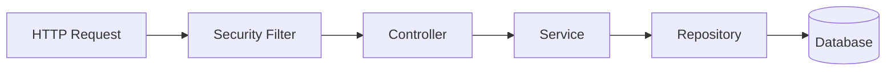
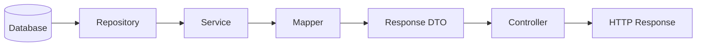
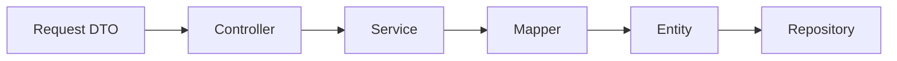
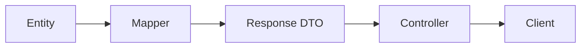
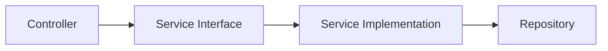
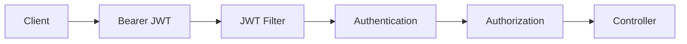
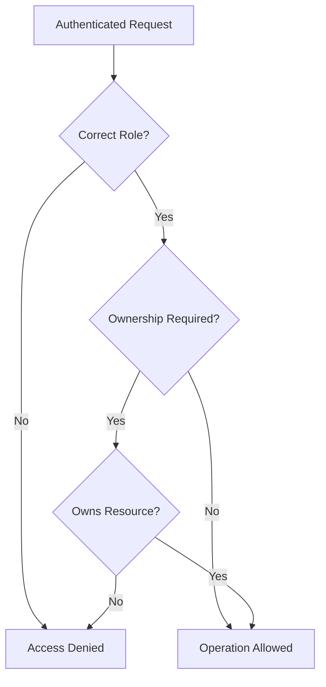
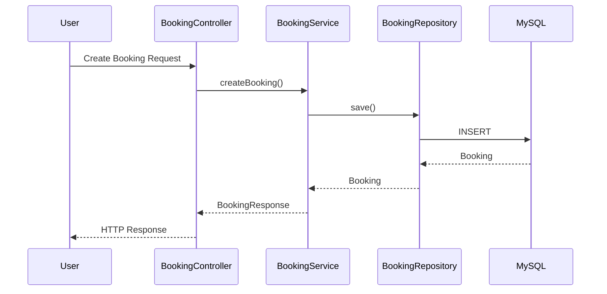
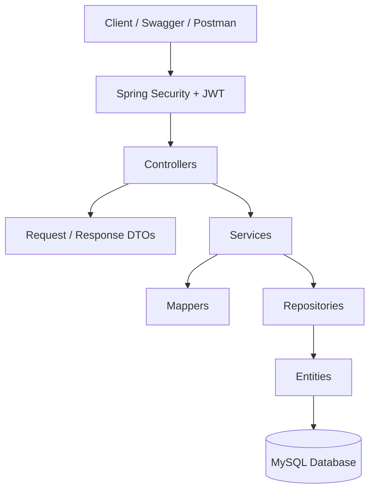

# Event Booking API — Architecture

## 1. Architecture Overview

The application follows a layered architecture where each layer has a specific responsibility.



This separation keeps the API, business logic, persistence logic, and database responsibilities independent.

---

## 2. Main Layers

| Layer | Responsibility |
|---|---|
| **Controller** | Handles HTTP requests and responses |
| **DTO** | Defines request and response models |
| **Service** | Contains business logic |
| **Mapper** | Converts between DTOs and entities |
| **Repository** | Handles database access |
| **Entity** | Represents database tables |
| **Security** | Authentication and authorization |

---

## 3. Request Flow

A typical request moves through the application as follows:



The response returns in the opposite direction:



---

## 4. DTO and Mapper Flow

DTOs are used to avoid exposing JPA entities directly through the API.



For responses:



---

## 5. Service Structure

The Service Layer separates interfaces from implementations.



Example:

```text
BookingController
        ↓
BookingService
        ↓
BookingServiceImpl
        ↓
BookingRepository
```

This improves separation of concerns and makes the application easier to test.

---

## 6. Security Flow

Protected requests pass through JWT authentication before reaching the controller.



Authorization checks can include:

- Authentication
- User role
- Resource ownership

---

## 7. Role and Ownership Check



This is especially important for `ORGANIZER` operations.

An organizer may have permission to manage events, but should only modify events they own.

---

## 8. Booking Request Example

A booking operation demonstrates how the main layers work together.



---

## 9. Complete Architecture



---

## 10. Architecture Summary

The main dependency flow is:

```text
Client
  ↓
Security
  ↓
Controller
  ↓
Service
  ↓
Repository
  ↓
Database
```

Supporting components:

```text
DTO      → API communication
Mapper   → DTO / Entity conversion
Security → Authentication and authorization
Exception Handler → Centralized error responses
```

This architecture keeps the application modular, testable, and easier to maintain.

---

**Next:** `03-DATABASE-DESIGN.md`