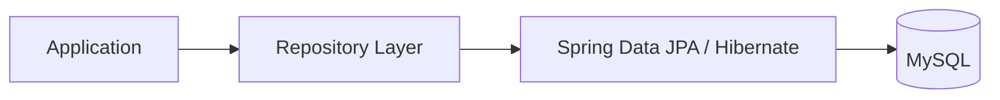
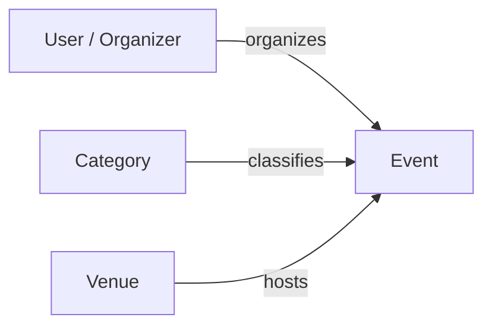
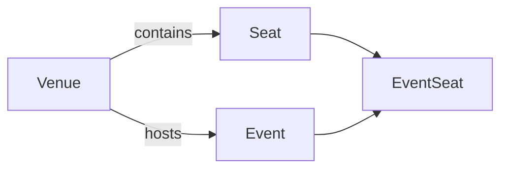
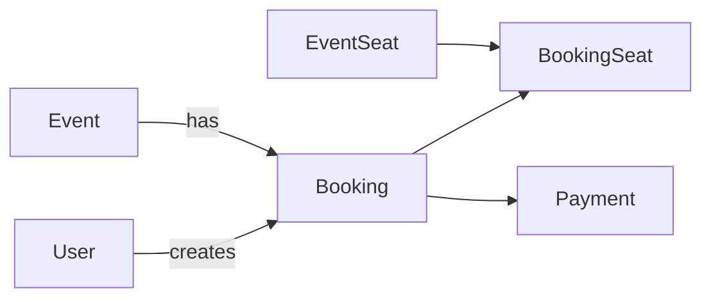
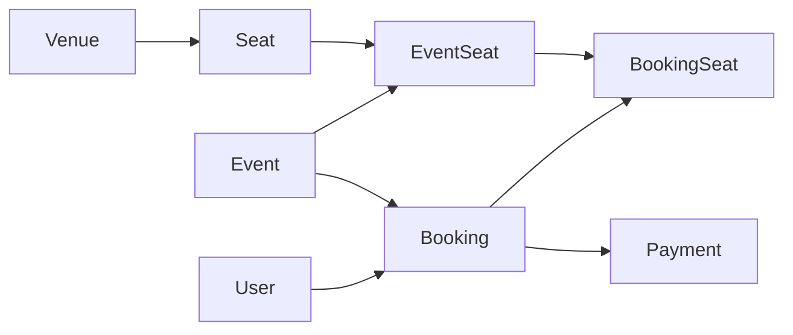
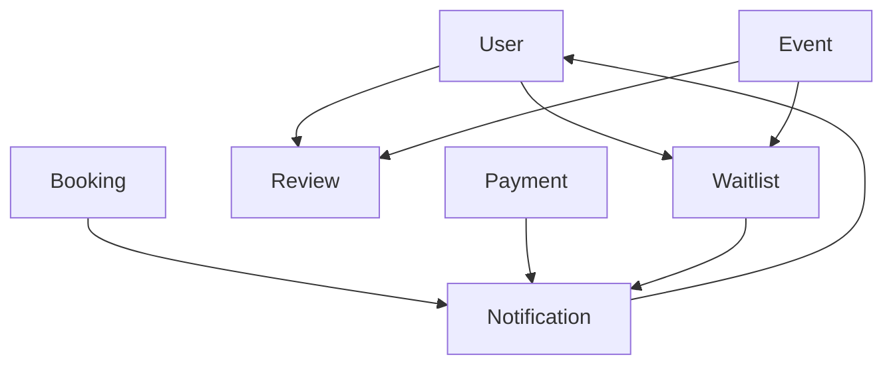
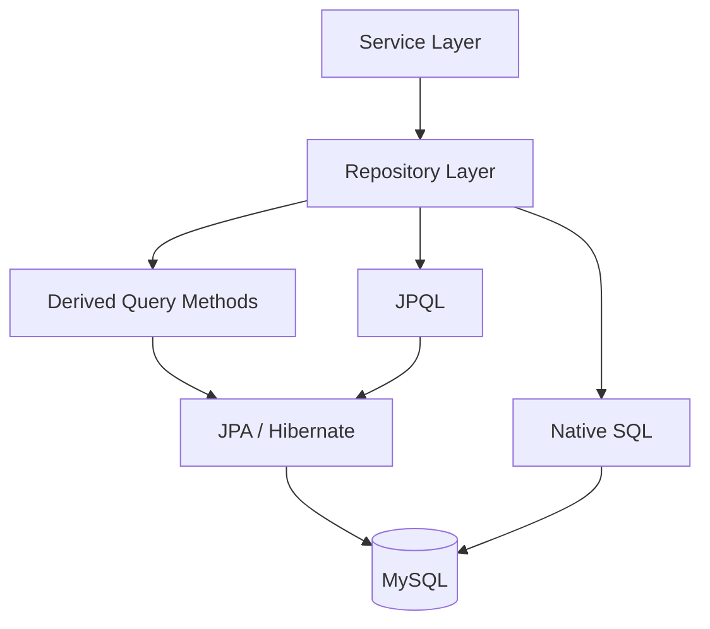

# Event Booking API — Database Design

## 1. Database Overview

The application uses **MySQL** as the relational database and
**Spring Data JPA / Hibernate** for persistence and object-relational
mapping.

Main entities:

- User
- Category
- Venue
- Seat
- Event
- EventSeat
- Booking
- BookingSeat
- Payment
- Waitlist
- Review
- Notification

The persistence layer is accessed through Spring Data JPA repositories.



---

## 2. Event Structure

An event is connected to an organizer, one or more categories and a
venue.



This allows the system to know:

- who owns the event
- which categories it belongs to
- where it takes place

The organizer relationship is also used by the service layer to enforce
event ownership rules.

---

## 3. Venue and Seat Structure

A venue contains physical seats.



### Meaning

- `Seat` = physical seat inside the venue
- `EventSeat` = that seat configured for a specific event

This allows the same physical seat to be reused for different events.

Example:

```text
Seat A1 + Event 1 = EventSeat A1 for Event 1
Seat A1 + Event 2 = EventSeat A1 for Event 2
```

The `EventSeat` entity keeps event-specific seat information separate
from the physical venue seat.

---

## 4. Booking Structure

A booking connects a user with an event.

Selected seats are connected through `BookingSeat`.



### Meaning

- `Booking` stores the reservation
- `BookingSeat` stores the selected seats
- `EventSeat` represents the seat for that specific event
- `Payment` belongs to the booking

This structure allows one booking to contain multiple selected seats
while keeping seat availability associated with the specific event.

---

## 5. Booking Data Flow

The core reservation structure is:



This is the main database flow of the booking process.

The structure separates the physical venue configuration from
event-specific availability and from the final reservation.

---

## 6. Waitlist, Review and Notification

These domains are connected to the user and event processes.



### Waitlist

Connects a user with an event when immediate booking is not possible.

### Review

Connects user feedback with an event.

### Notification

Stores notifications generated by booking, payment or waitlist
operations and associates them with the receiving user.

---

## 7. Relationship Summary

| Entity | Main Relationship |
| --- | --- |
| User | Organizes Events |
| User | Creates Bookings |
| User | Joins Waitlists |
| User | Creates Reviews |
| User | Receives Notifications |
| Category | Associated with Events |
| Venue | Hosts Events |
| Venue | Contains Seats |
| Event | Has EventSeats |
| Event | Has Bookings |
| Event | Has Categories |
| Seat | Used by EventSeat |
| Booking | Contains BookingSeats |
| EventSeat | Connected to BookingSeat |
| Booking | Has Payment |

---

## 8. Data Access Layer

Database access is handled through the **Repository Layer** using
Spring Data JPA.

The application demonstrates three database querying approaches:

```text
Derived Query Methods
        +
JPQL
        +
Native SQL
```



### 8.1 Derived Query Methods

Derived query methods are used throughout the repository layer for
common database operations.

Examples:

```java
List<Event> findByOrganizerId(Long organizerId);

List<Booking> findByEventId(Long eventId);

List<Event> findByCategoriesId(Long categoryId);

List<Booking> findByUserIdAndBookingStatus(
        Long userId,
        BookingStatus bookingStatus
);

boolean existsByUserIdAndEventId(
        Long userId,
        Long eventId
);
```

Spring Data JPA derives the required query automatically from the method
name.

For example:

```java
findByEventId(eventId);
```

is interpreted by Spring Data JPA as a query that retrieves records
associated with the specified event.

---

### 8.2 JPQL Query

A JPQL query is implemented in `EventRepository` for retrieving events
by their status.

```java
@Query(
        "SELECT e FROM Event e WHERE e.eventStatus = :status"
)
List<Event> findEventsByStatusJPQL(
        @Param("status") EventStatus status
);
```

JPQL works with the JPA domain model.

Therefore:

```text
Event
eventStatus
```

refer to the Java entity and its field rather than directly to the
physical MySQL table and column names.

The query is used by the Event service when retrieving events by status.

The flow is:

```text
Controller
    ↓
EventService
    ↓
EventServiceImpl
    ↓
EventRepository
    ↓
findEventsByStatusJPQL(...)
    ↓
JPA / Hibernate
    ↓
MySQL
```

---

### 8.3 Native SQL Query

A native SQL query is implemented in `BookingRepository` for retrieving
the bookings of a specific user.

```java
@Query(
        value = "SELECT * FROM bookings WHERE user_id = :userId",
        nativeQuery = true
)
List<Booking> findBookingsByUserNative(
        @Param("userId") Long userId
);
```

Unlike JPQL, the native query works directly with the physical database
structure.

In this query:

```text
bookings
```

is the MySQL table and:

```text
user_id
```

is the foreign-key column connecting a booking to a user.

The query is used when the authenticated user retrieves their own
bookings.

The flow is:

```text
Controller
    ↓
BookingService
    ↓
BookingServiceImpl
    ↓
BookingRepository
    ↓
findBookingsByUserNative(...)
    ↓
MySQL
```

---

### 8.4 Query Strategy Summary

| Query Type | Repository | Example |
| --- | --- | --- |
| Derived Query Method | Multiple repositories | `findByEventId(...)` |
| JPQL | `EventRepository` | `findEventsByStatusJPQL(...)` |
| Native SQL | `BookingRepository` | `findBookingsByUserNative(...)` |

The three approaches are used according to the needs of the persistence
layer while keeping database access isolated from the controller and
business logic layers.

---

## 9. Database Summary

The most important database relationships are:


The design separates:

```text
Physical Seat
      ↓
Event-Specific Seat
      ↓
Reserved / Sold Seat
```

This keeps venue configuration, event availability and booking data
independent and reusable.

At application level, database access follows:

```text
Service
   ↓
Repository
   ↓
Spring Data JPA
   ├── Derived Query Methods
   ├── JPQL
   └── Native SQL
   ↓
Hibernate / MySQL
```

This keeps persistence concerns inside the repository layer without
changing the domain model or the external REST API.

---

**Next:** `04-DOMAIN-LIFECYCLE.md`