# Event Booking API — Domain Lifecycle

## 1. Overview

The main application domains have different states during the booking process.

This document presents the lifecycle of:

- Event
- EventSeat
- Booking
- Payment
- Waitlist
- Notification

---

## 2. Event Lifecycle

An event moves through different states during its lifecycle.

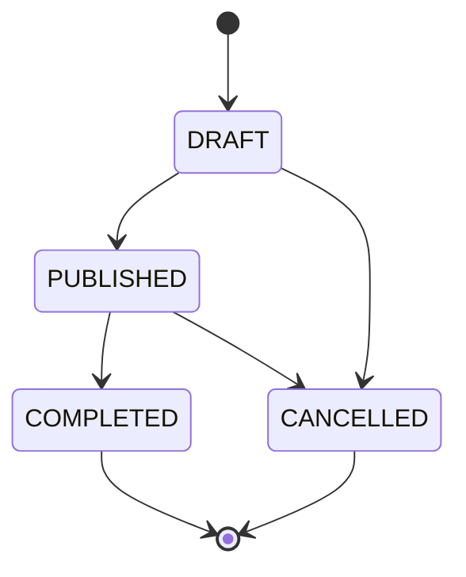

### Flow

`DRAFT` → event is created but not active.

`PUBLISHED` → event is available to users.

`COMPLETED` → event has finished.

`CANCELLED` → event has been cancelled.

---

## 3. EventSeat Lifecycle

`EventSeat` represents the status of a seat for a specific event.

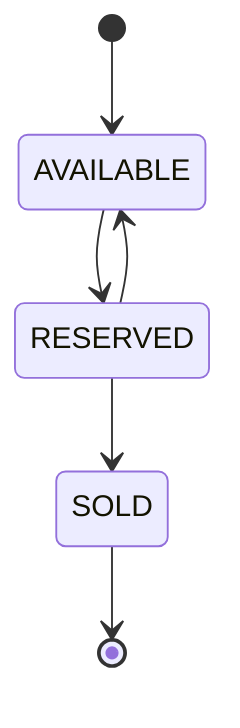

### Flow

- `AVAILABLE` — seat can be selected.
- `RESERVED` — seat belongs to an active booking.
- `SOLD` — booking/payment process has been completed.
- A cancelled reservation can return the seat to `AVAILABLE`.

---

## 4. Booking Lifecycle

A booking starts when a user successfully reserves one or more event seats.

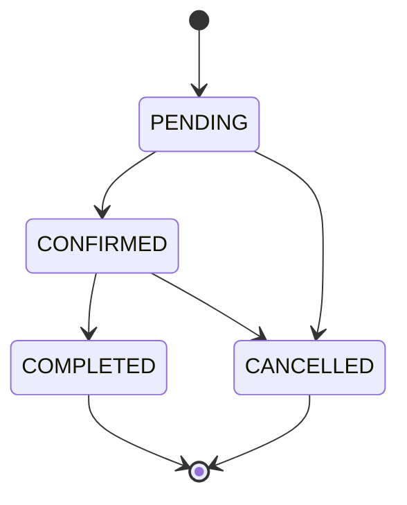

### Main Flow

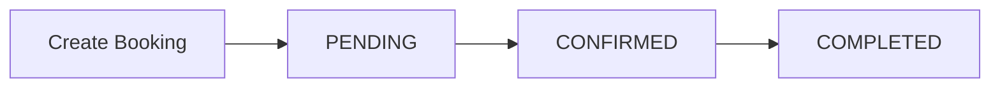

Alternative flow:

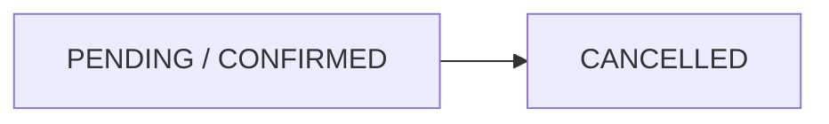

---

## 5. Payment Lifecycle

A payment is connected to a booking.

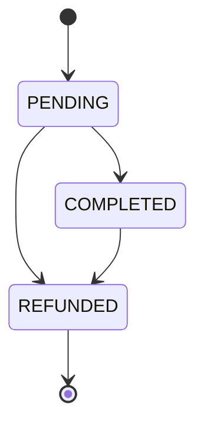

### Main Flow

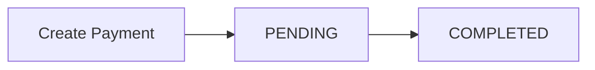

If a refund is required:

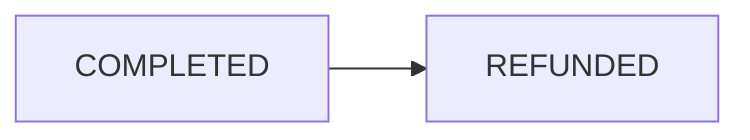

---

## 6. Waitlist Lifecycle

When booking is not possible, the user can join the event waitlist.

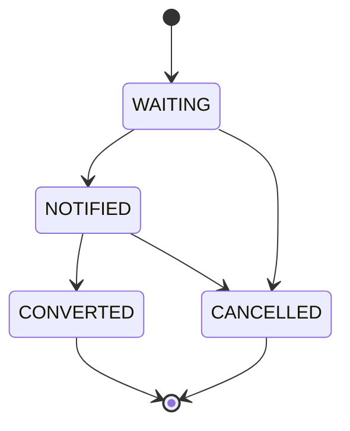

### Main Flow

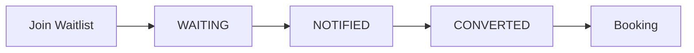

This creates a direct connection between the waitlist and booking process.

---

## 7. Notification Lifecycle

Notifications inform users about important system operations.

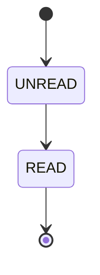

Notifications can be generated by:

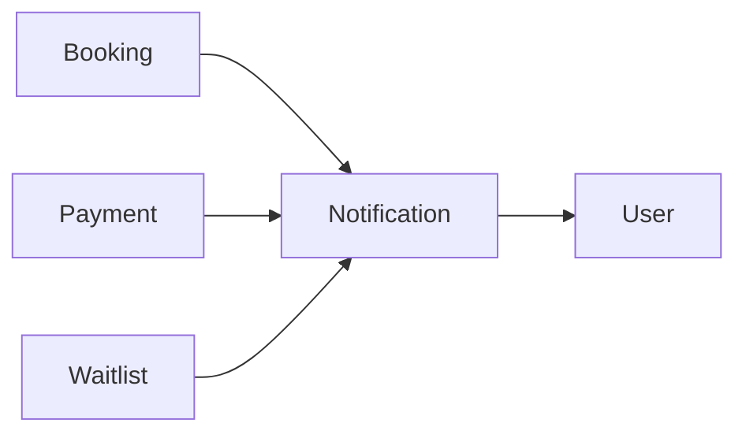

---

## 8. Booking + Seat + Payment Lifecycle

The most important combined lifecycle is the reservation process.

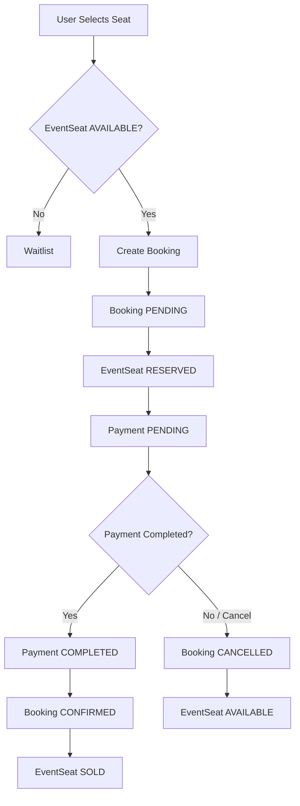

This flow keeps the status of the booking, payment and event seat synchronized.

---

## 9. Waitlist to Booking Lifecycle

The alternative booking path starts when seats are unavailable.

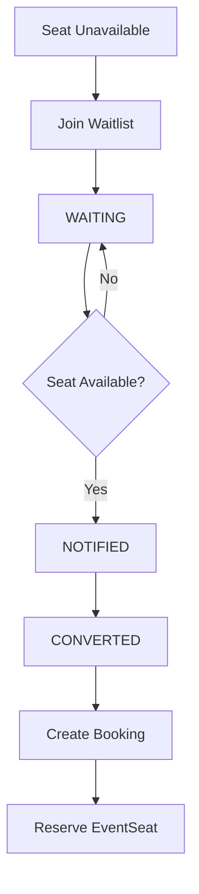

---

## 10. Lifecycle Summary

The main domain lifecycles are:

| Domain | Main Flow |
|---|---|
| **Event** | DRAFT → PUBLISHED → COMPLETED |
| **EventSeat** | AVAILABLE → RESERVED → SOLD |
| **Booking** | PENDING → CONFIRMED → COMPLETED |
| **Payment** | PENDING → COMPLETED |
| **Waitlist** | WAITING → NOTIFIED → CONVERTED |
| **Notification** | UNREAD → READ |

Alternative states such as `CANCELLED` and `REFUNDED` handle interrupted or reversed processes.

---

## Core Business Lifecycle

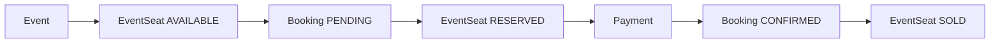

This lifecycle represents the core business process of the Event Booking API.

---

**Next:** `05-API-ENDPOINTS.md`