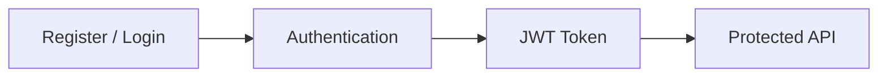
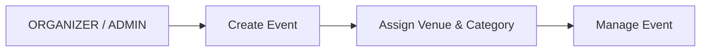
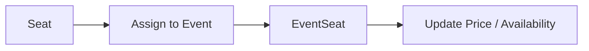
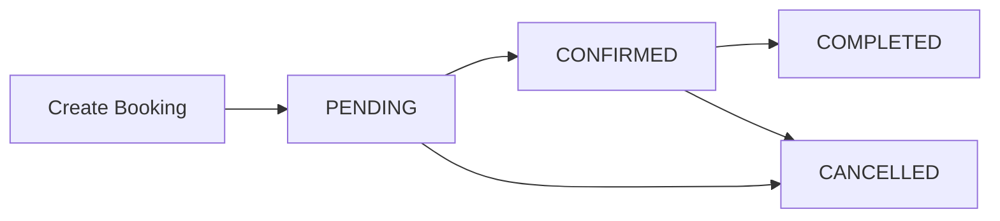
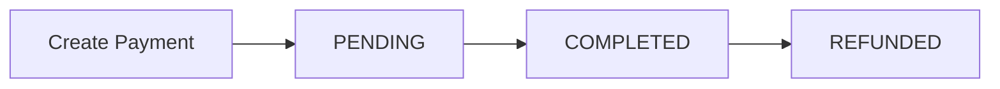
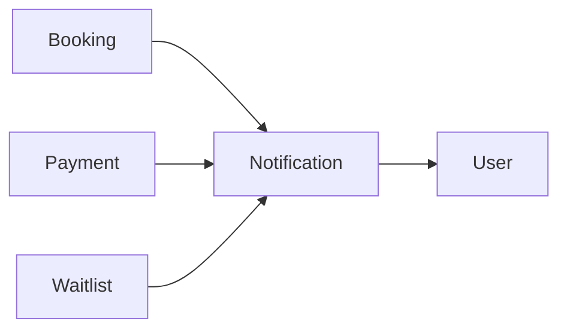
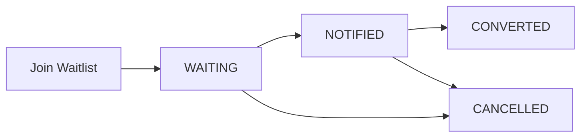
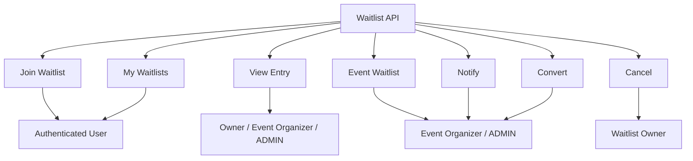
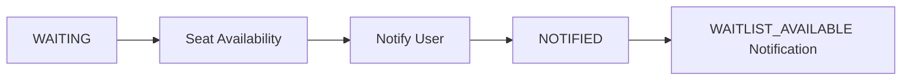
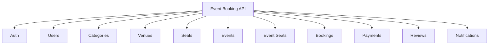

# Event Booking API — API Endpoints

## 1. API Overview

The API follows REST principles and uses JSON for request and response bodies.

Protected endpoints require a JWT token:

```http
Authorization: Bearer <JWT_TOKEN>
```

### Access Levels

| Access | Description |
|---|---|
| **Public** | Authentication not required |
| **Authenticated** | USER, ORGANIZER or ADMIN |
| **USER OWNER / ADMIN** | Resource owner or ADMIN |
| **ORGANIZER OWNER / ADMIN** | Event organizer or ADMIN |
| **ADMIN** | Administrator only |

---

# 2. Authentication

Base URL:

```text
/api/auth
```

| Method | Endpoint | Access | Description |
|---|---|---|---|
| `POST` | `/register` | Public | Register a new user and return JWT |
| `POST` | `/login` | Public | Authenticate user and return JWT |



---

# 3. Users

Base URL:

```text
/api/users
```

| Method | Endpoint | Access | Description |
|---|---|---|---|
| `GET` | `/me` | Authenticated | Get current user profile |
| `PUT` | `/me` | Authenticated | Update current user profile |
| `PATCH` | `/me/password` | Authenticated | Change current user password |
| `GET` | `/` | ADMIN | Get all users |
| `GET` | `/{id}` | ADMIN | Get user by ID |
| `DELETE` | `/{id}` | ADMIN | Delete user |
| `PATCH` | `/{id}/role` | ADMIN | Update user role |

---

# 4. Categories

Base URL:

```text
/api/categories
```

| Method | Endpoint | Access | Description |
|---|---|---|---|
| `POST` | `/` | ADMIN | Create category |
| `GET` | `/` | Public | Get all categories |
| `GET` | `/{id}` | Public | Get category by ID |
| `PUT` | `/{id}` | ADMIN | Update category |
| `DELETE` | `/{id}` | ADMIN | Delete category |

---

# 5. Venues

Base URL:

```text
/api/venues
```

| Method | Endpoint | Access | Description |
|---|---|---|---|
| `POST` | `/` | ADMIN | Create venue |
| `GET` | `/` | Public | Get all venues |
| `GET` | `/{id}` | Public | Get venue by ID |
| `PUT` | `/{id}` | ADMIN | Update venue |
| `DELETE` | `/{id}` | ADMIN | Delete venue |

---

# 6. Seats

Base URL:

```text
/api/seats
```

`Seat` represents a physical seat inside a venue.

| Method | Endpoint | Access | Description |
|---|---|---|---|
| `POST` | `/` | ADMIN | Create seat |
| `GET` | `/` | Public | Get all seats |
| `GET` | `/{id}` | Public | Get seat by ID |
| `GET` | `/venue/{venueId}` | Public | Get seats by venue |
| `PUT` | `/{id}` | ADMIN | Update seat |
| `DELETE` | `/{id}` | ADMIN | Delete seat |

---

# 7. Events

Base URL:

```text
/api/events
```

| Method | Endpoint | Access | Description |
|---|---|---|---|
| `POST` | `/` | ORGANIZER / ADMIN | Create event |
| `GET` | `/` | Public | Get all events |
| `GET` | `/{id}` | Public | Get event by ID |
| `GET` | `/organizer/{organizerId}` | Public | Get events by organizer |
| `GET` | `/status/{status}` | Public | Get events by status |
| `GET` | `/category/{categoryId}` | Public | Get events by category |
| `GET` | `/venue/{venueId}` | Public | Get events by venue |
| `PUT` | `/{eventId}` | ORGANIZER OWNER / ADMIN | Update event |
| `DELETE` | `/{eventId}` | ORGANIZER OWNER / ADMIN | Delete event |

### Event Management Flow



---

# 8. Event Seats

Base URL:

```text
/api/event-seats
```

`EventSeat` represents a physical seat assigned to a specific event.

| Method | Endpoint | Access | Description |
|---|---|---|---|
| `POST` | `/event/{eventId}` | ORGANIZER OWNER / ADMIN | Assign seat to event |
| `GET` | `/{id}` | Public | Get event seat by ID |
| `GET` | `/event/{eventId}` | Public | Get all seats for event |
| `GET` | `/event/{eventId}/status/{status}` | Public | Get event seats by status |
| `PATCH` | `/{eventSeatId}/price` | ORGANIZER OWNER / ADMIN | Update event seat price |
| `DELETE` | `/{eventSeatId}` | ORGANIZER OWNER / ADMIN | Delete event seat |

### Update Price

The price is sent as a request parameter:

```text
PATCH /api/event-seats/{eventSeatId}/price?priceSeat=50.00
```

### EventSeat Flow



---

# 9. Bookings

Base URL:

```text
/api/bookings
```

| Method | Endpoint | Access | Description |
|---|---|---|---|
| `POST` | `/` | Authenticated | Create booking |
| `GET` | `/{bookingId}` | USER OWNER / ADMIN | Get booking by ID |
| `GET` | `/me` | Authenticated | Get current user's bookings |
| `GET` | `/me/status/{status}` | Authenticated | Get current user's bookings by status |
| `GET` | `/event/{eventId}` | ORGANIZER OWNER / ADMIN | Get bookings for event |
| `PATCH` | `/{bookingId}/confirm` | ORGANIZER OWNER / ADMIN | Confirm booking |
| `PATCH` | `/{bookingId}/cancel` | USER OWNER / ADMIN | Cancel booking |
| `PATCH` | `/{bookingId}/complete` | ORGANIZER OWNER / ADMIN | Complete booking |

The controller explicitly allows authenticated `USER`, `ORGANIZER`, and `ADMIN` accounts to create their own booking, while ownership and organizer checks are applied to later operations.

### Booking Lifecycle



When a booking is confirmed, its reserved event seats are changed to `SOLD`. Cancellation releases the reserved seats.

---

# 10. Payments

Base URL:

```text
/api/payments
```

| Method | Endpoint | Access | Description |
|---|---|---|---|
| `POST` | `/booking/{bookingId}` | BOOKING OWNER / ADMIN | Create payment |
| `GET` | `/{paymentId}` | PAYMENT OWNER / ADMIN | Get payment by ID |
| `GET` | `/booking/{bookingId}` | BOOKING OWNER / ADMIN | Get payment by booking |
| `PATCH` | `/{paymentId}/complete` | PAYMENT OWNER / ADMIN | Complete payment |
| `PATCH` | `/{paymentId}/refund` | PAYMENT OWNER / ADMIN | Refund payment |

### Payment Flow



---

# 11. Reviews

Base URL:

```text
/api/reviews
```

| Method | Endpoint | Access | Description |
|---|---|---|---|
| `POST` | `/` | Authenticated | Create review |
| `GET` | `/{reviewId}` | Public | Get review by ID |
| `GET` | `/event/{eventId}` | Public | Get reviews by event |
| `GET` | `/me` | Authenticated | Get current user's reviews |
| `PUT` | `/{reviewId}` | OWNER / ADMIN | Update review |
| `DELETE` | `/{reviewId}` | OWNER / ADMIN | Delete review |

A review can be created only when the implemented business rules are satisfied, including event completion and user attendance.

---

# 12. Notifications

Base URL:

```text
/api/notifications
```

| Method | Endpoint | Access | Description |
|---|---|---|---|
| `GET` | `/me` | Authenticated | Get current user's notifications |
| `GET` | `/me/unread` | Authenticated | Get unread notifications |
| `GET` | `/me/unread/count` | Authenticated | Count unread notifications |
| `GET` | `/{notificationId}` | OWNER / ADMIN | Get notification by ID |
| `PATCH` | `/{notificationId}/read` | OWNER / ADMIN | Mark notification as read |
| `PATCH` | `/me/read-all` | Authenticated | Mark all notifications as read |

### Notification Flow



---


# 13. Waitlists

Base URL:

```text
/api/waitlists
```

The Waitlist module manages users waiting for seats when an event does not currently have enough availability.

| Method  | Endpoint                           | Access                               | Description                  |
| ------- | ---------------------------------- | ------------------------------------ | ---------------------------- |
| `POST`  | `/event/{eventId}`                 | Authenticated                        | Join an event waitlist       |
| `GET`   | `/my`                              | Authenticated                        | Get current user's waitlists |
| `GET`   | `/{waitlistId}`                    | USER OWNER / ORGANIZER OWNER / ADMIN | Get waitlist by ID           |
| `GET`   | `/event/{eventId}`                 | ORGANIZER OWNER / ADMIN              | Get waitlist for an event    |
| `GET`   | `/event/{eventId}/status/{status}` | ORGANIZER OWNER / ADMIN              | Get event waitlist by status |
| `PATCH` | `/{waitlistId}/notify`             | ORGANIZER OWNER / ADMIN              | Mark waitlist as notified    |
| `PATCH` | `/{waitlistId}/convert`            | ORGANIZER OWNER / ADMIN              | Mark waitlist as converted   |
| `PATCH` | `/{waitlistId}/cancel`             | USER OWNER                           | Cancel waitlist entry        |

---

## Waitlist Lifecycle



### Main Rules

* Users can join the waitlist when a `PUBLISHED` event does not have enough available seats.
* A new waitlist entry starts as `WAITING`.
* `WAITING` can be changed to `NOTIFIED` by the event organizer or ADMIN.
* When marked as `NOTIFIED`, the system creates a `WAITLIST_AVAILABLE` notification.
* Only a `NOTIFIED` entry can be converted to `CONVERTED`.
* The waitlist owner can cancel a `WAITING` or `NOTIFIED` entry.
* A `CONVERTED` entry cannot be cancelled.

---

## Waitlist Access Flow



---

## Waitlist → Notification

When availability becomes available, the organizer can notify the waiting user.




# 14. Endpoint Summary



---

## 15. HTTP Methods Used

| Method | Purpose |
|---|---|
| `GET` | Retrieve resources |
| `POST` | Create resources |
| `PUT` | Replace/update resources |
| `PATCH` | Perform partial updates or state transitions |
| `DELETE` | Delete resources |

---

## 16. Common HTTP Responses

| Status | Meaning |
|---|---|
| `200 OK` | Request completed successfully |
| `201 Created` | Resource created successfully |
| `204 No Content` | Operation completed without response body |
| `400 Bad Request` | Invalid request or business rule violation |
| `401 Unauthorized` | Authentication required or invalid |
| `403 Forbidden` | Authenticated user has insufficient permissions |
| `404 Not Found` | Resource not found |
| `409 Conflict` | Resource already exists or conflicts with existing data |

---

## 17. Swagger / OpenAPI

Detailed request and response models are documented through **Swagger / OpenAPI**.

Swagger is the preferred source for:

- Request body structure
- Response body structure
- Validation requirements
- API testing
- JWT-protected endpoint testing

This file acts as a quick reference for the application's endpoint structure.

---

---

**Next:** `06-SECURITY.md`