# Event Booking API — Security

## 1. Security Overview

The application uses **Spring Security** and **JWT** for stateless authentication and authorization.

The security model is based on:

- JWT Authentication
- Role-Based Authorization
- Resource Ownership
- Stateless Session Management
- BCrypt Password Encoding
- Custom `401 Unauthorized` responses
- Custom `403 Forbidden` responses

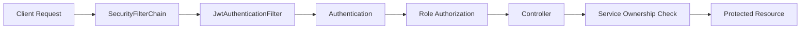

---

## 2. Stateless Security

The application does not use server-side HTTP sessions.

Spring Security is configured with:

```text
SessionCreationPolicy.STATELESS
```

CSRF protection is disabled because the API uses JWT-based authentication.

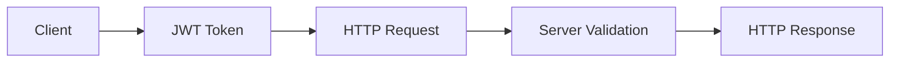

---

## 3. Authentication Components

The security configuration exposes:

- `PasswordEncoder`
- `AuthenticationManager`
- `SecurityFilterChain`
- `JwtAuthenticationFilter`
- `CustomAuthenticationEntryPoint`
- `CustomAccessDeniedHandler`

The configured password encoder is:

```text
BCryptPasswordEncoder
```

---

## 4. Authentication Flow

Authentication is performed through the public authentication endpoints.

```text
POST /api/auth/register
POST /api/auth/login
```

A successful login returns a JWT that can be used for protected requests.

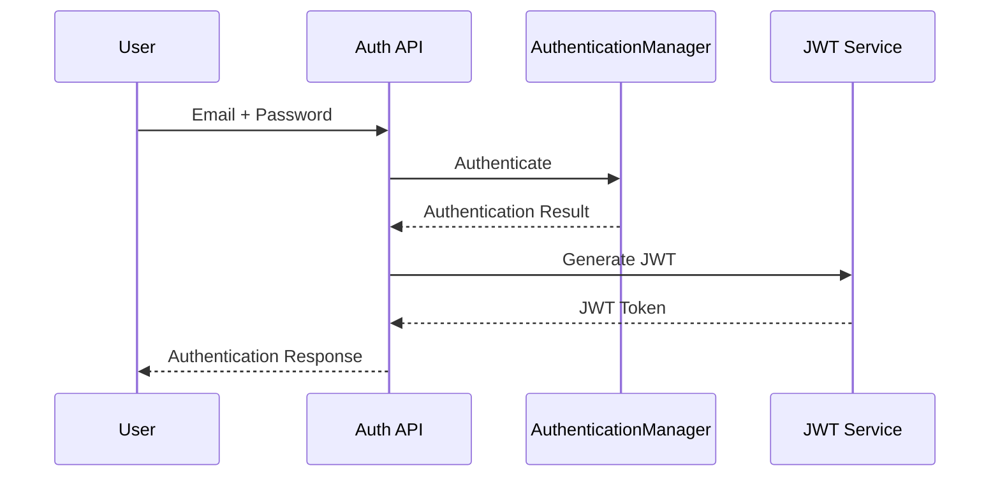

---

## 5. JWT Protected Request

Protected requests send the JWT in the `Authorization` header:

```http
Authorization: Bearer <JWT_TOKEN>
```

The JWT filter is executed before:

```text
UsernamePasswordAuthenticationFilter
```

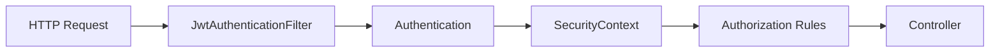

The exact handling of malformed, expired or otherwise invalid JWTs depends on the implementation of `JwtAuthenticationFilter`.

---

## 6. Public Resources

The following routes are explicitly public.

### Swagger / OpenAPI

```text
/swagger-ui/**
/swagger-ui.html
/v3/api-docs/**
```

### Authentication

```text
/api/auth/**
```

### Events

```text
GET /api/events/**
```

### Venues

```text
GET /api/venues/**
```

### Categories

```text
GET /api/categories/**
```

### Seats

```text
GET /api/seats/**
```

### Event Seats

```text
GET /api/event-seats/**
```

### Reviews

```text
GET /api/reviews/event/*
GET /api/reviews/*
```

These routes do not require authentication.

---

## 7. Application Roles

The application uses three roles:

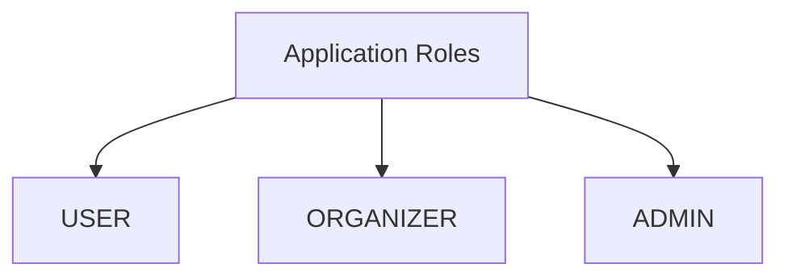

Role-based authorization is applied in the `SecurityFilterChain`.

Ownership validation is handled separately in the Service layer where required.

---

## 8. Current User Operations

Authenticated users can access their own profile operations.

```text
/api/users/me
/api/users/me/**
```

These routes require:

```text
Authenticated User
```

They are intentionally defined before:

```text
/api/users/**
```

because all remaining user administration routes require `ADMIN`.

---

## 9. User Administration

All remaining routes under:

```text
/api/users/**
```

require:

```text
ADMIN
```

This includes operations such as:

- Get all users
- Get user by ID
- Delete user
- Update user role

---

## 10. Category Security

Reading categories is public:

```text
GET /api/categories/**
```

Category management requires `ADMIN`:

```text
POST   /api/categories/**
PUT    /api/categories/**
DELETE /api/categories/**
```

---

## 11. Venue Security

Reading venues is public:

```text
GET /api/venues/**
```

Venue management requires `ADMIN`:

```text
POST   /api/venues/**
PUT    /api/venues/**
DELETE /api/venues/**
```

---

## 12. Seat Security

Reading seats is public:

```text
GET /api/seats/**
```

Seat management requires `ADMIN`:

```text
POST   /api/seats/**
PUT    /api/seats/**
DELETE /api/seats/**
```

---

## 13. Event Security

Reading events is public:

```text
GET /api/events/**
```

Creating an event requires:

```text
ORGANIZER / ADMIN
```

```text
POST /api/events
```

Updating and deleting events also require:

```text
ORGANIZER / ADMIN
```

```text
PUT    /api/events/**
DELETE /api/events/**
```

For `ORGANIZER`, ownership is checked in the Service layer.

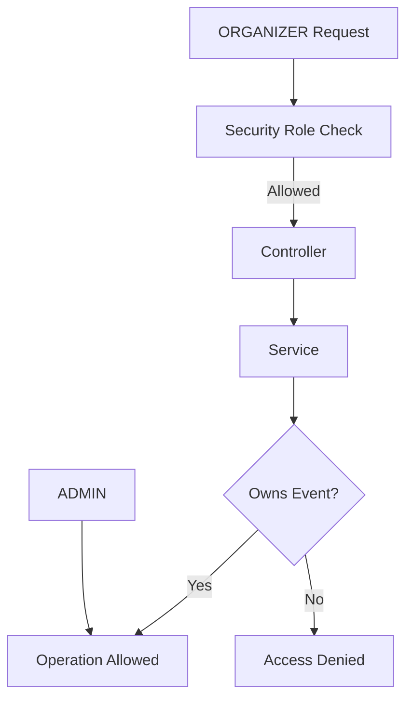

---

## 14. EventSeat Security

Reading event seats is public:

```text
GET /api/event-seats/**
```

Management operations require:

```text
ORGANIZER / ADMIN
```

```text
POST   /api/event-seats/**
PATCH  /api/event-seats/**
DELETE /api/event-seats/**
```

For organizer operations, event ownership is checked in the Service layer.

---

## 15. Booking Security

### Create Booking

```text
POST /api/bookings
```

Requires:

```text
Authenticated User
```

No specific role is required by `SecurityFilterChain`.

---

### Personal Bookings

```text
GET /api/bookings/me
GET /api/bookings/me/status/*
```

Require:

```text
Authenticated User
```

These matchers are defined before the generic booking matcher.

---

### Event Bookings

```text
GET /api/bookings/event/*
```

Requires:

```text
ORGANIZER / ADMIN
```

Event ownership is handled in the Service layer.

---

### Confirm Booking

```text
PATCH /api/bookings/*/confirm
```

Requires:

```text
ORGANIZER / ADMIN
```

---

### Complete Booking

```text
PATCH /api/bookings/*/complete
```

Requires:

```text
ORGANIZER / ADMIN
```

---

### Cancel Booking

```text
PATCH /api/bookings/*/cancel
```

Requires:

```text
Authenticated User
```

Booking ownership is checked in the Service layer.

---

### Get Booking by ID

```text
GET /api/bookings/*
```

Requires:

```text
Authenticated User
```

Booking ownership is checked in the Service layer.

---

### Booking Security Flow

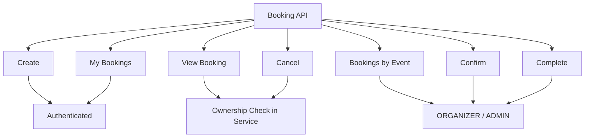

---

## 16. Payment Security

All payment routes require authentication:

```text
/api/payments/**
```

`SecurityConfig` does not restrict these endpoints to a specific role.

Ownership and business authorization are checked in the Service layer.

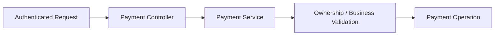

---

## 17. Review Security

### Public Review Reads

```text
GET /api/reviews/event/*
GET /api/reviews/*
```

are public.

### Personal Reviews

```text
GET /api/reviews/me
```

requires authentication.

This matcher appears before the generic public:

```text
GET /api/reviews/*
```

matcher.

### Create Review

```text
POST /api/reviews
```

requires authentication.

### Update and Delete

```text
PUT    /api/reviews/*
DELETE /api/reviews/*
```

require authentication.

Review ownership is checked in the Service layer.

---

## 18. Waitlist Security

### Join Waitlist

```text
POST /api/waitlists/event/*
```

requires:

```text
Authenticated User
```

### Personal Waitlists

```text
GET /api/waitlists/my
```

requires authentication.

### Event Waitlist

```text
GET /api/waitlists/event/*
GET /api/waitlists/event/*/status/*
```

require:

```text
ORGANIZER / ADMIN
```

### Notify and Convert

```text
PATCH /api/waitlists/*/notify
PATCH /api/waitlists/*/convert
```

require:

```text
ORGANIZER / ADMIN
```

### Cancel Waitlist

```text
PATCH /api/waitlists/*/cancel
```

requires:

```text
Authenticated User
```

Waitlist ownership is checked in the Service layer.

### Get Waitlist by ID

```text
GET /api/waitlists/*
```

requires:

```text
Authenticated User
```

Ownership and event-organizer access are checked in the Service layer.

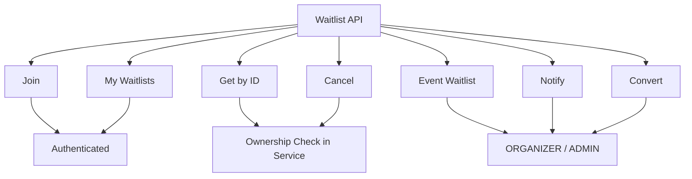

---

## 19. Notification Security

All routes under:

```text
/api/notifications/**
```

require authentication.

Ownership validation is handled in the Service layer where required.

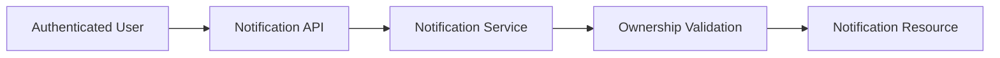

---

## 20. Password Encoder

Spring Security exposes a `PasswordEncoder` bean using:

```text
BCryptPasswordEncoder
```

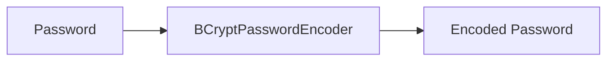

`SecurityConfig` confirms the encoder configuration.

The actual use of this encoder during registration or password changes is implemented outside `SecurityConfig`.

---

## 21. Custom Security Errors

The application configures:

```text
CustomAuthenticationEntryPoint
CustomAccessDeniedHandler
```

These components are used for authentication and authorization failures.

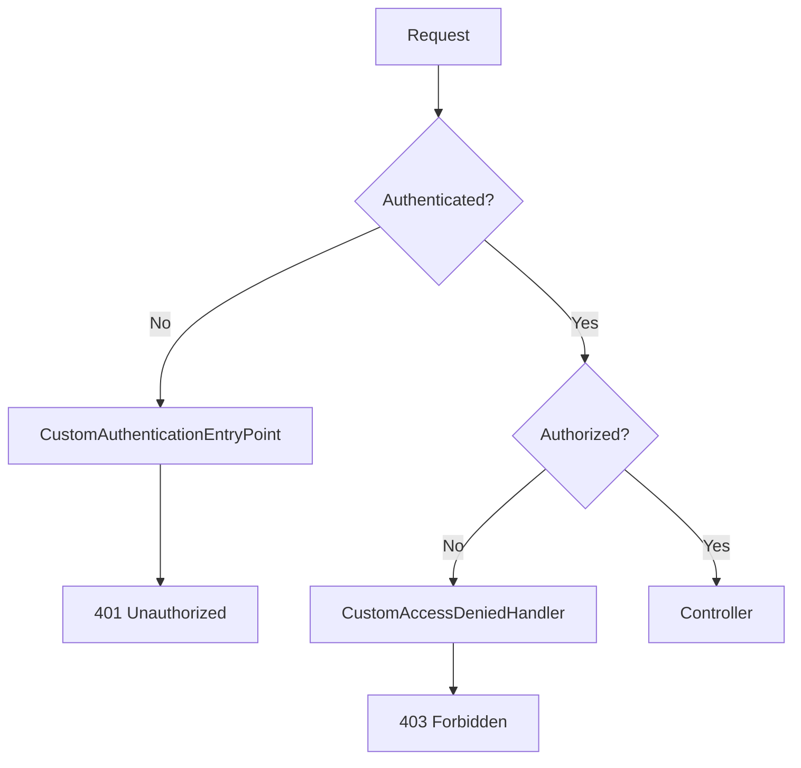

---

## 22. Matcher Order

Matcher order is important because Spring Security evaluates authorization rules in sequence.

Specific routes are defined before broader wildcard routes.

Examples:

```text
/api/users/me
before
/api/users/**
```

```text
/api/bookings/me
before
/api/bookings/*
```

```text
/api/reviews/me
before
/api/reviews/*
```

```text
/api/waitlists/event/*
before
/api/waitlists/*
```

This prevents generic rules from overriding more specific access requirements.

---

## 23. Default Security Rule

The final authorization rule is:

```text
.anyRequest().authenticated()
```

This means any request not matched by an earlier public or role-specific rule requires authentication by default.

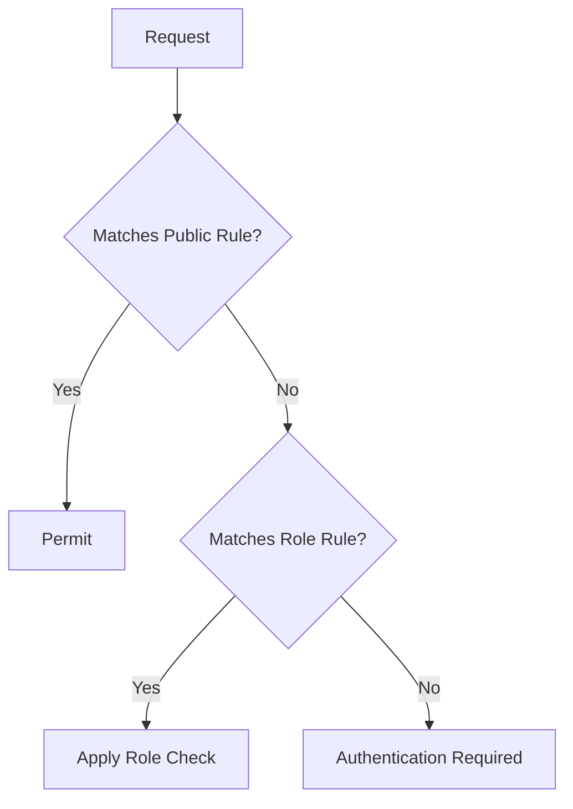

---

## 24. Security Summary

The complete security flow is:

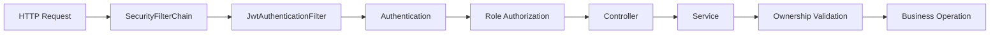

The responsibilities are separated as follows:

| Layer | Responsibility |
|---|---|
| **JWT Filter** | Authentication processing |
| **SecurityFilterChain** | Public, authenticated and role-based endpoint access |
| **Controller** | Receives authorized requests |
| **Service** | Ownership and business-rule validation |
| **CustomAuthenticationEntryPoint** | Handles authentication failures |
| **CustomAccessDeniedHandler** | Handles authorization failures |

This provides both **endpoint-level security** and **resource-level authorization**.

---

**Next:** `07-BEAN-LIFECYCLE.md`