# Event Booking API — Bean Lifecycle

## 1. Overview

The Event Booking API uses the **Spring IoC Container** to create, configure and manage application components.

The main Spring-managed components are:

- Controllers
- Services
- Repositories
- Mappers
- Security components
- Configuration beans

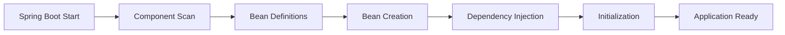

---

## 2. Bean Discovery

Spring discovers application components through annotations such as:

```text
@RestController
@Service
@Repository
@Component
@Configuration
@Bean
```

Example:

```java
@Service
public class EventServiceImpl implements EventService {
}
```

`EventServiceImpl` is registered and managed by the Spring IoC Container.

---

## 3. Dependency Injection

The project primarily uses **constructor-based dependency injection**.

Example:

```java
private final EventService eventService;

public EventController(EventService eventService) {
    this.eventService = eventService;
}
```

Dependencies are not manually instantiated inside application components.

Spring resolves the required beans and injects them automatically.

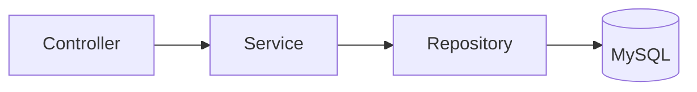

---

## 4. Dependency Graph

Spring creates beans according to their dependencies rather than following a fixed global creation order.

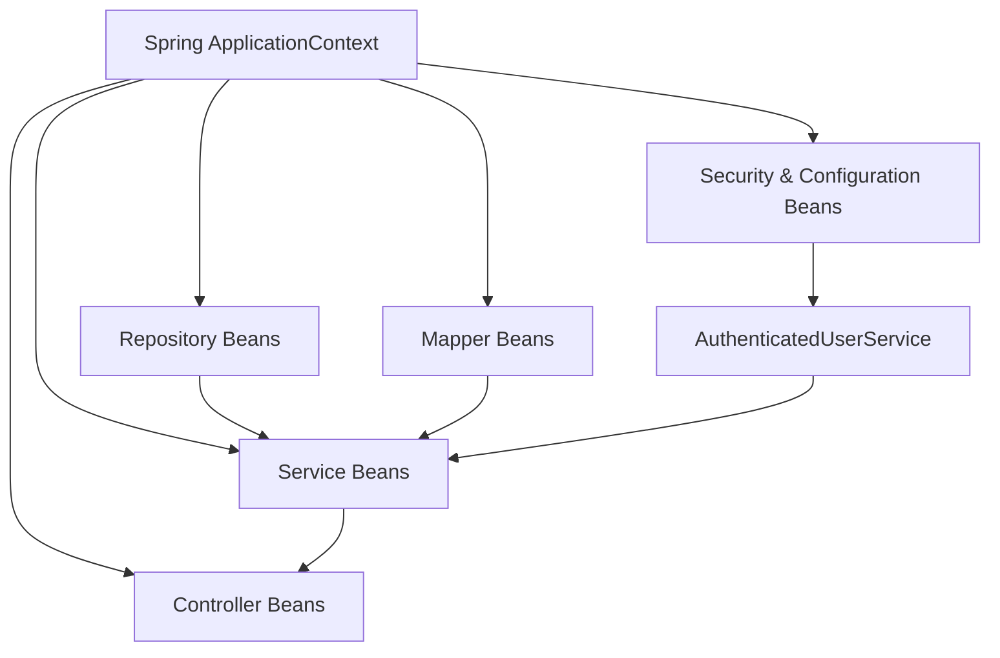

Each bean becomes available after Spring resolves and injects its required dependencies.

---

## 5. Controller Beans

Controllers are registered using `@RestController`.

Their main responsibilities are:

- Receive HTTP requests
- Validate request DTOs
- Delegate operations to services
- Return HTTP responses


Controllers depend on service interfaces instead of creating service implementations directly.

---

## 6. Service Beans

Business logic is implemented in classes annotated with `@Service`.

Examples include:

```text
AuthServiceImpl
UserServiceImpl
CategoryServiceImpl
VenueServiceImpl
SeatServiceImpl
EventServiceImpl
EventSeatServiceImpl
BookingServiceImpl
PaymentServiceImpl
ReviewServiceImpl
WaitlistServiceImpl
NotificationServiceImpl
```

Services coordinate:

- Business rules
- Repositories
- Mappers
- Authentication information
- Other services
- Transactions

---

## 7. Service Dependency Example — Event

`EventServiceImpl` coordinates several Spring-managed dependencies.

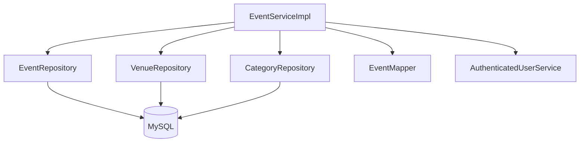

These dependencies support event persistence, venue/category resolution, DTO mapping and organizer ownership validation.

---

## 8. Service Dependency Example — Booking

`BookingServiceImpl` demonstrates a service with a larger dependency graph.

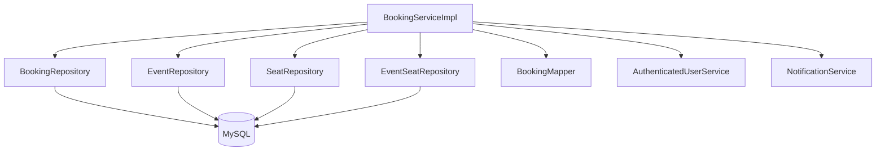

This allows the Booking service to coordinate booking persistence, events, seats, authentication and notifications.

---

## 9. Repository Beans

Repositories provide access to persistent data.

Examples include:

```text
UserRepository
CategoryRepository
VenueRepository
SeatRepository
EventRepository
EventSeatRepository
BookingRepository
PaymentRepository
ReviewRepository
WaitlistRepository
NotificationRepository
```

Spring Data JPA generates the repository implementations at runtime.

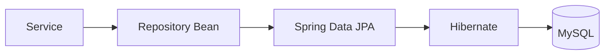

Standard CRUD repository implementations therefore do not need to be written manually.

---

## 10. Mapper Beans

Spring-managed mappers are used to separate API DTOs from persistence entities.


Examples of mapper dependencies include:

```text
EventServiceImpl
      ↓
EventMapper
```

and:

```text
BookingServiceImpl
      ↓
BookingMapper
```

This keeps DTO conversion outside controllers and business entities.

---

## 11. Security-Related Components

Security components protect the application before requests reach protected endpoints.

The project also uses `AuthenticatedUserService` inside business logic when the current authenticated user is required.

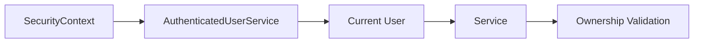

This supports business rules such as:

```text
Event Organizer Ownership
Booking Ownership
Payment Ownership
Review Ownership
EventSeat Ownership
```

---

## 12. Configuration Beans

Some infrastructure components are explicitly registered using `@Bean`.

Important security-related examples include:

```text
PasswordEncoder
AuthenticationManager
SecurityFilterChain
```

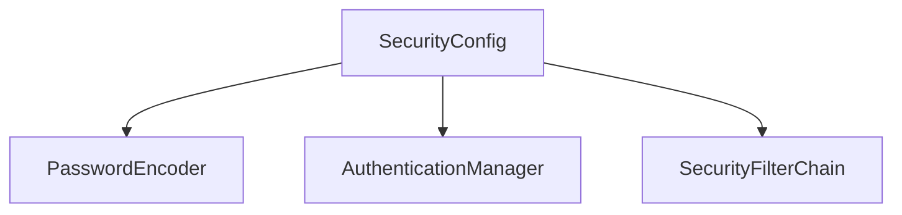

These beans become part of the same Spring `ApplicationContext`.

---

## 13. Transaction Management

Business operations are executed inside Spring-managed transactions where `@Transactional` is applied.

Write operations use:

```java
@Transactional
```

Read-only operations can use:

```java
@Transactional(readOnly = true)
```

A simplified transaction flow is:

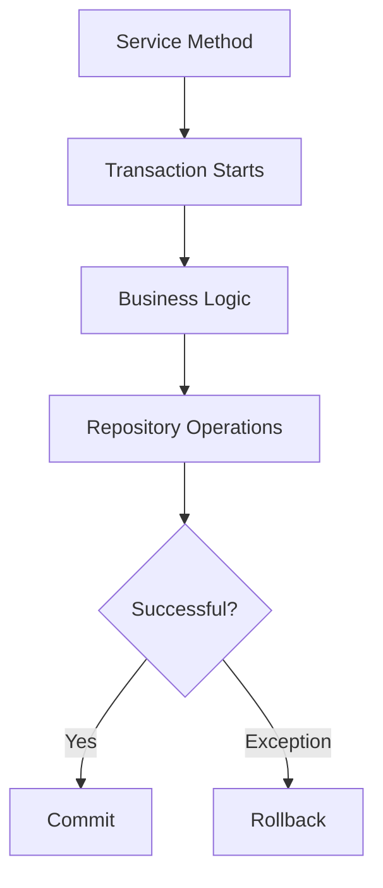

Transaction management is applied around service operations by Spring.

---

## 14. Default Bean Scope

Spring-managed application components are **singleton-scoped by default**, unless another scope is explicitly configured.

Typical examples are:

```text
Controller
Service
Repository
Mapper
Security Component
Configuration Bean
```

This normally means one bean instance per Spring `ApplicationContext`.

JPA entities such as:

```text
User
Event
Seat
Booking
Payment
```

are **not Spring singleton beans**.

They represent persistent domain data managed through JPA/Hibernate.

---

## 15. Bean Lifecycle

The simplified lifecycle of a Spring bean is:

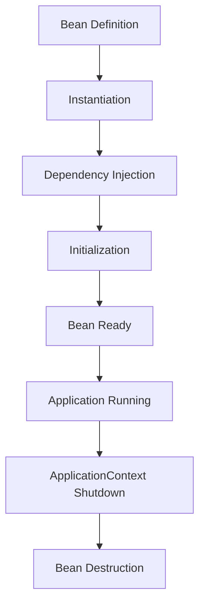

The core lifecycle can therefore be summarized as:

```text
Bean Definition
      ↓
Instantiation
      ↓
Dependency Injection
      ↓
Initialization
      ↓
Bean Ready
      ↓
Application Execution
      ↓
Destruction
```

---

## 16. Bean Lifecycle vs Request Flow

These are two different concepts.

### Bean Lifecycle

Describes how Spring creates and manages application components.

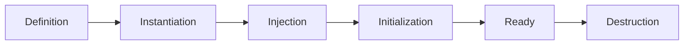

### Request Flow

Describes how already-created beans collaborate when an API request arrives.

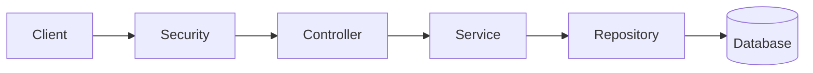

The mapper participates separately in DTO/entity conversion:


---

## 17. Application Runtime Flow

After Spring initializes the required beans, a typical request follows:

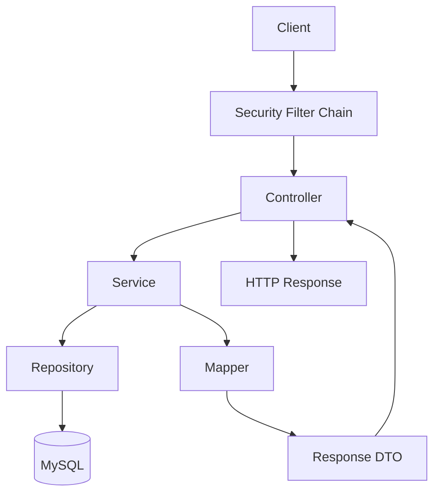

This represents runtime collaboration between beans and should not be confused with bean creation order.

---

## 18. Complete Spring Structure

The main Spring-managed structure of the application can be summarized as:

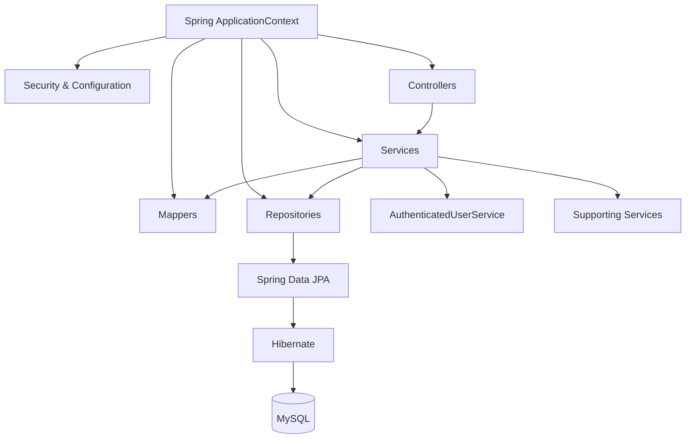

---

## 19. Component Responsibilities

| Component | Main Responsibility |
|---|---|
| **Controller** | HTTP request and response handling |
| **Service** | Business logic and transactions |
| **Repository** | Persistence and database access |
| **Mapper** | DTO ↔ Entity conversion |
| **AuthenticatedUserService** | Current authenticated user access |
| **Security** | Authentication and authorization |
| **Configuration** | Infrastructure bean creation |

---

## 20. Summary

Spring Boot manages the application components through the **IoC Container**.

The main bean lifecycle is:

```text
Discover
   ↓
Create
   ↓
Inject Dependencies
   ↓
Initialize
   ↓
Use
   ↓
Destroy
```

Once initialized, these beans collaborate through the application architecture:

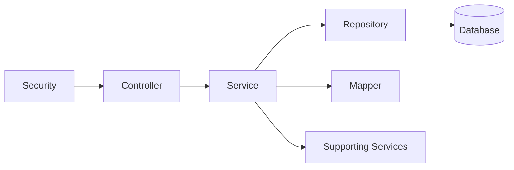

This architecture provides clear separation of responsibilities while Spring manages object creation, dependency injection, transactions and application infrastructure.

---

**Next:** `08-TESTING.md`