# Event Booking API — Testing

## 1. Testing Overview

The Event Booking API uses automated tests across the main application layers.

The testing strategy covers:

* Repository Layer
* Service Layer
* Controller Layer
* Security Layer

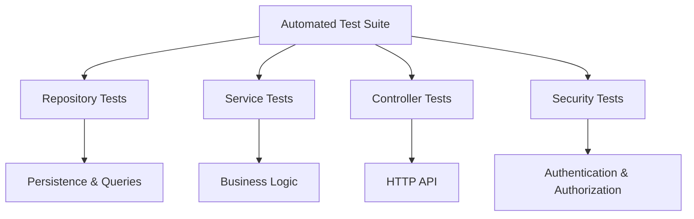

Each layer is tested independently according to its responsibility.

---

## 2. Testing Technologies

The project uses:

* **JUnit 5**
* **Mockito**
* **MockMvc**
* **Spring Boot Test**
* **Spring Security Test**
* **Spring Data JPA Test**

Service tests primarily use:

```java
@ExtendWith(MockitoExtension.class)
```

with:

```java
@Mock
@InjectMocks
```

Repository tests use:

```java
@DataJpaTest
@ActiveProfiles("test")
@AutoConfigureTestDatabase(
        replace = AutoConfigureTestDatabase.Replace.NONE
)
```

Controller tests use either standalone `MockMvc` or `@WebMvcTest`.

---

# 3. Repository Tests

Repository tests verify persistence behavior and custom Spring Data JPA queries.

The following repositories are covered:

| Repository   | Main Tests                                    |
| ------------ | --------------------------------------------- |
| User         | Email lookup and existence                    |
| Category     | Category name lookup and duplicate checks     |
| Venue        | Venue lookup by name and city                 |
| Seat         | Venue seats and seat uniqueness               |
| Event        | Organizer, status, category and venue filters |
| EventSeat    | Event, seat and status queries                |
| Booking      | User, event and booking-status queries        |
| Payment      | Booking and transaction lookup                |
| Review       | User/event reviews and existence              |
| Waitlist     | FIFO ordering, user/event/status queries      |
| Notification | Ordering, unread filtering and counts         |

Repository coverage is verified across the main domain repositories.

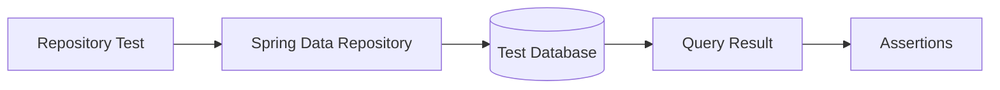

The tests cover not only standard persistence, but also custom queries such as:

```text
findByUserIdAndBookingStatus(...)
findByOrganizerIdAndEventStatus(...)
findByEventIdAndStatusSeat(...)
findByTransactionId(...)
findByEventIdOrderByCreatedAtAsc(...)
countByUserIdAndNotificationStatus(...)
```

---

# 4. Service Tests

Service tests verify the business logic while repositories, mappers and supporting services are mocked.

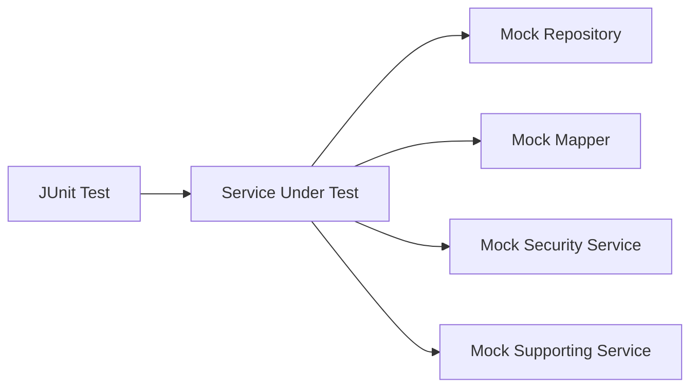

The following service modules are tested:

| Service      | Important Coverage                          |
| ------------ | ------------------------------------------- |
| Auth         | Registration, login, JWT, password encoding |
| User         | Profile, password change, roles             |
| Category     | CRUD and duplicate categories               |
| Venue        | CRUD and resource validation                |
| Seat         | CRUD, venue validation, duplicates          |
| Event        | Dates, capacity, ownership, status          |
| EventSeat    | Assignment, price, ownership, availability  |
| Booking      | Reservation, seats, ownership, lifecycle    |
| Payment      | Amount, completion, refund, ownership       |
| Review       | Eligibility, ownership, duplicate reviews   |
| Waitlist     | Duplicate entry and notification transition |
| Notification | Creation, unread/read operations            |

---

## 5. Authentication & User Business Rules

Authentication tests verify:

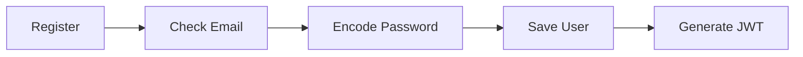

They verify:

* Successful registration
* Duplicate email rejection
* Password encoding
* JWT generation
* Successful login
* AuthenticationManager interaction
* User not found handling

User tests also verify:

* Current user retrieval
* Profile updates
* Duplicate email protection
* Password verification
* Password confirmation
* New password must differ from current password
* Role updates
* User deletion

---

# 6. Event & Seat Business Rules

Event tests verify important domain rules:

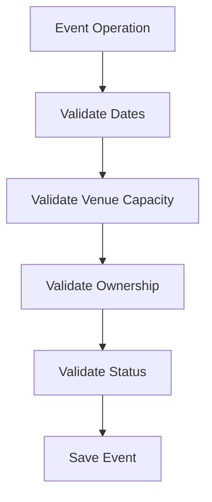

Important tested cases include:

* Event creation
* End date after start date
* Venue capacity limits
* Organizer ownership
* `DRAFT → PUBLISHED`
* Protection of completed events
* Delete restrictions
* Event filtering

Seat and EventSeat tests verify:

* Venue existence
* Duplicate seats
* Seat assignment to events
* Duplicate EventSeat assignment
* Organizer ownership
* Seat price validation
* Only `AVAILABLE` EventSeats can be deleted
* ADMIN can manage allowed EventSeat operations

---

# 7. Booking Lifecycle Tests

Booking contains some of the most important business tests in the project.

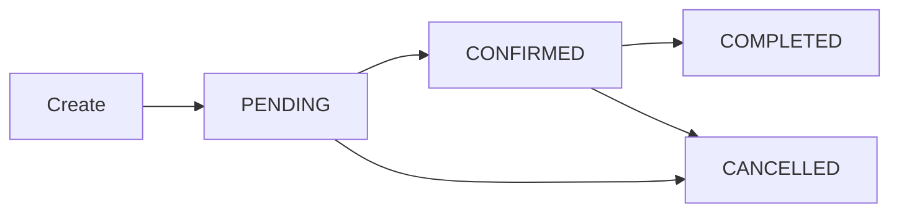

Booking creation verifies:

* Event availability
* Available seat count
* Duplicate seat selection
* Physical seat existence
* Seat assignment to event
* EventSeat availability

Successful booking creation changes:

```text
EventSeat: AVAILABLE → RESERVED
```

and decreases:

```text
eventAvailableSeats
```

Confirmation changes:

```text
Booking: PENDING → CONFIRMED
EventSeat: RESERVED → SOLD
```

Cancellation restores seats:

```text
RESERVED / SOLD → AVAILABLE
```

and restores the event available-seat count.

Completion requires:

```text
CONFIRMED → COMPLETED
```

Ownership is also verified for both the booking user and event organizer.

---

# 8. Payment Tests

Payment tests verify the payment lifecycle:

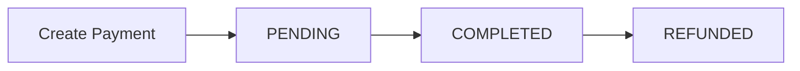

Important tests include:

* Payment amount calculated from EventSeat prices
* Duplicate payment prevention
* Cancelled bookings cannot be paid
* Booking ownership
* Payment completion
* Payment date generation
* Transaction ID generation
* Refund only from `COMPLETED`
* Payment notifications

Payment completion generates:

```text
PAYMENT_COMPLETED
```

Refund generates:

```text
PAYMENT_REFUNDED
```

---

# 9. Review Tests

Review tests verify that users cannot review arbitrary events.

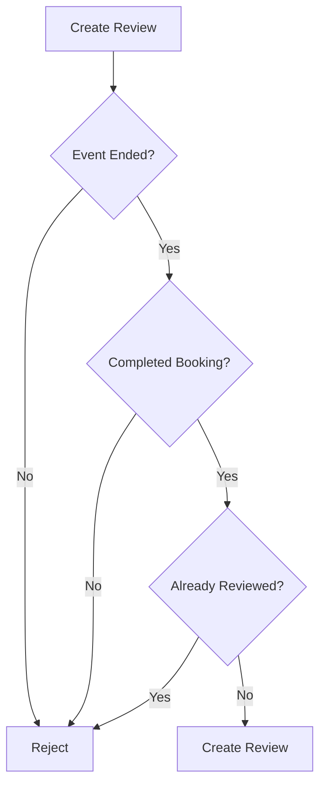

Tests cover:

* Event must have ended
* User must have a completed booking
* One review per user/event
* Review ownership
* Review cannot be moved to another event
* Owner update/delete
* ADMIN delete

---

# 10. Waitlist & Notification Tests

Waitlist tests verify duplicate-entry protection and status changes.

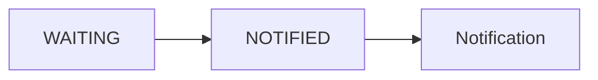

When a waitlist entry becomes `NOTIFIED`, the service creates:

```text
WAITLIST_AVAILABLE
```

notification.

Notification tests verify:

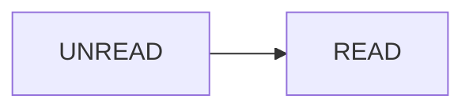

including:

* Notification creation
* Current user's notifications
* Unread filtering
* Unread count
* Mark as read
* Mark all as read
* Avoid unnecessary save when already read

---

# 11. Controller Tests

Controller tests verify the HTTP layer separately from business logic.

They test:

* Endpoint mappings
* HTTP methods
* Request bodies
* Request validation
* HTTP status codes
* JSON responses
* Service invocation

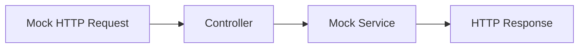

The Controller layer covers:

```text
Auth
User
Category
Venue
Seat
Event
EventSeat
Booking
Payment
Review
Waitlist
Notification
```

For example, controller tests verify expected responses such as:

```text
200 OK
201 Created
204 No Content
400 Bad Request
```

## The tests also verify that invalid DTOs return `400 Bad Request` without calling the service layer.

# 12. Security Tests

Security is tested separately using:

```java
@SpringBootTest
@AutoConfigureMockMvc
@ActiveProfiles("test")
```

and Spring Security test users.

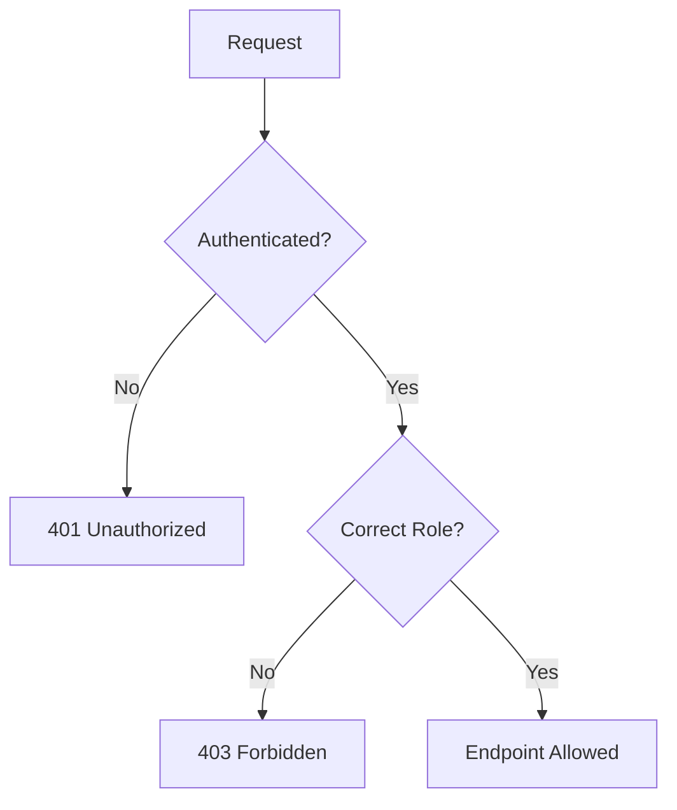

Security tests verify:

### Public Access

Examples:

```text
GET /api/events
GET /api/venues
GET /api/reviews/event/{id}
```

### Authentication

Anonymous users are rejected from protected endpoints with:

```text
401 Unauthorized
```

Examples include:

```text
/api/users/me
/api/bookings
/api/payments/**
/api/waitlists/**
/api/notifications/**
```

### Role Authorization

Tests verify restrictions such as:

```text
Create Event
→ ORGANIZER / ADMIN

Create Venue
→ ADMIN

Create Category
→ ADMIN

Create Seat
→ ADMIN

Manage EventSeat
→ ORGANIZER / ADMIN

Confirm Booking
→ ORGANIZER / ADMIN

Manage Event Waitlist
→ ORGANIZER / ADMIN
```

Unauthorized authenticated roles receive:

```text
403 Forbidden
```

---

# 13. Layer Responsibility

| Test Layer     | Responsibility                          |
| -------------- | --------------------------------------- |
| **Repository** | Persistence and custom queries          |
| **Service**    | Business rules and ownership            |
| **Controller** | HTTP requests, responses and validation |
| **Security**   | Authentication and role authorization   |

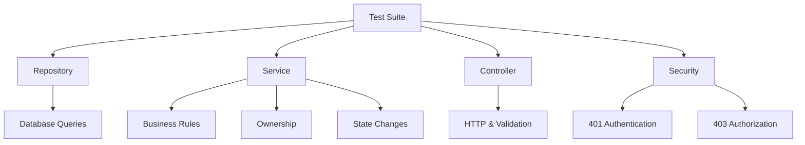

---

# 14. Key Business Flows Covered

The most important cross-domain behavior covered by the tests includes:

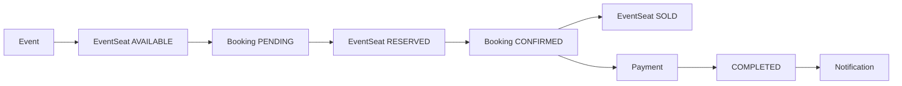

Additional tested flows include:

```text
Booking cancellation → seats released
Payment completion → notification
Payment refund → notification
Waitlist notification → WAITLIST_AVAILABLE
Completed booking → review eligibility
```

---

# 15. Test Execution

Run all tests with Maven:

```bash
./mvnw test
```

or perform a clean test execution:

```bash
./mvnw clean test
```

A successful suite finishes with:

```text
BUILD SUCCESS
```

---

# 16. Testing Summary

The Event Booking API follows a layered testing strategy:

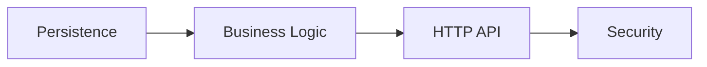

The most important areas validated by the test suite are:

* Database queries
* DTO validation
* CRUD operations
* Duplicate-resource protection
* Resource ownership
* Event lifecycle
* Seat availability
* Booking lifecycle
* Payment lifecycle
* Review eligibility
* Waitlist behavior
* Notification generation
* Authentication
* Role-based authorization

This provides coverage across both the technical layers and the core business workflows of the application.

---

**Next:** `09-SETUP.md`
